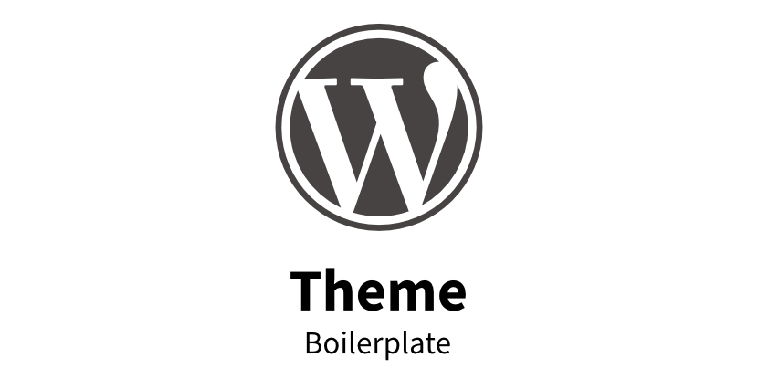

# WordPress Theme

- [About](#about)
- [Features](#features)
- [How to use](#how-to-use)

 

---

  

## About

Generic and theme-independent child theme. It's a development-focused boilerplate with minimalist and modern code style. Does not contain any actual content or styling.

**Intended for developers – Not end users**

  

## Features

- Load child theme CSS styles.
- Support loading debugging code for DEV environments (placeholder)

  

## How to use

Copy the folder content in your WordPress installation.

### Config

1. Set parent theme name and replace 'XXX' placeholders:
   - `/wp-content/themes/codeconutltd-generic/style.css`
2. Adjust the constant definitions for development mode as needed:
   - `/wp-content/themes/codeconutltd-generic/functions.php`
3. Custom development-mode solutions can be implemented here:
   - `/wp-content/themes/codeconutltd-generic/init-dev.php`
